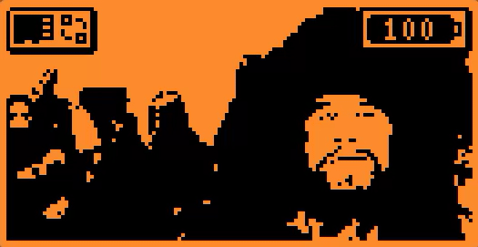
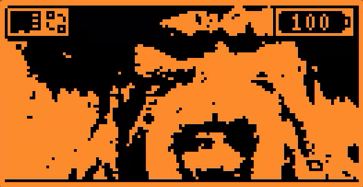
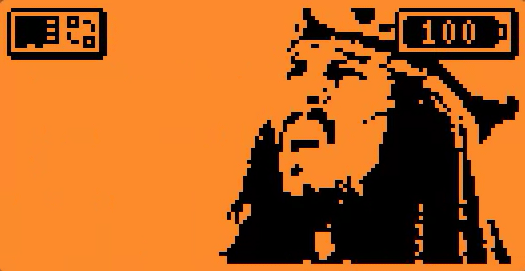
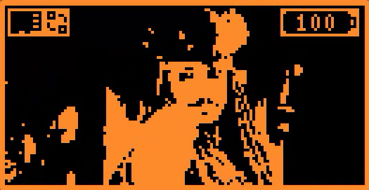
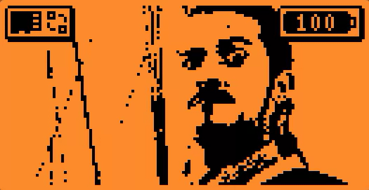
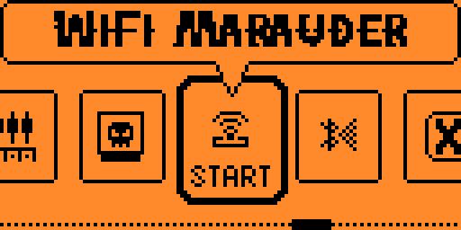
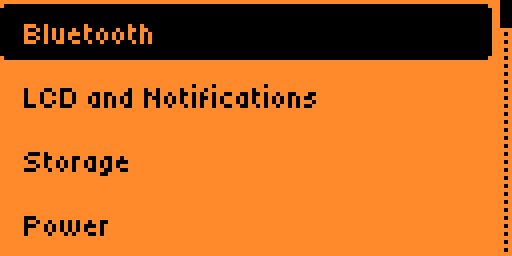
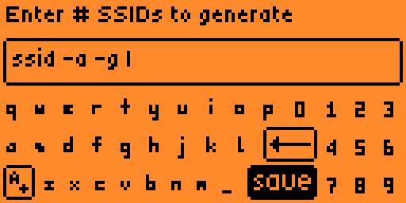
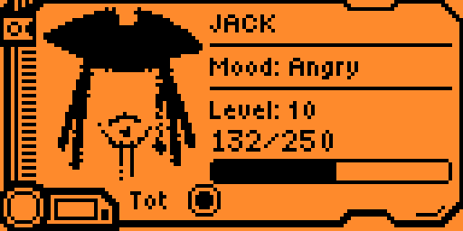

<div align="center">
    <h1>🏴‍☠️ flipper-pirates-asset-pack 🏴‍☠️</h1>
    <p><i>"Do you fear death? Do you fear that dark abyss? All your deeds laid bare, all your sins punished?"</i><p>
</div>

## ℹ️ Introduction

This is a custom asset pack that I built for my Flipper Zero. The main theme is Pirates of the Caribbean and all the animations are based on scenes taken from the various movies. If you want to install the pack on your Flipper check the section [below](#-installation).

> [!NOTE]
> This asset pack is a working in progress. New animations and icons will be added in the future.

## 🐬 Firmwares support

*Note: the asset pack has been created primarly for Xtreme firmware.*

✅ = tested and working

❌ = not supported

❓ = not tested

| Firmware | Animations | Fonts | Passport |
| :--- | :---: | :---: | :---: |
| Official | ❓ | ❓ | ❓ |
| Xtreme | ✅ | ✅* | ✅ |
| Unleashed | ✅ | ❓ | ❓ |
| RogueMaster | ❓ | ❓ | ❓ |

\* needs latest build of XFW with custom fonts support

## 🚀 Installation

> [!TIP]
> Want to take a look before installing the pack on your flipper? Check the section [below](#-showcase).

To install the asset pack, download the zipped pack on your computer using the link below, extract it and copy the directory on your Flipper's SD (follow the instructions for your firmware):

- **Xtreme firmware**: [xtreme_pirates_asset_pack.zip](https://github.com/cyberartemio/flipper-pirates-asset-pack/raw/main/build/xtreme_pirates_asset_pack.zip)
- **Unleashed firmware**: [unleashed_pirates_asset_pack.zip](https://github.com/cyberartemio/flipper-pirates-asset-pack/raw/main/build/unleashed_pirates_asset_pack.zip)

### ⚙️ Building the pack locally

#### Xtreme firmware

1. Clone the repo locally:
```sh
git clone https://github.com/cyberartemio/flipper-pirates-asset-pack.git
```
2. Inside the repo directory, download `asset_packer.py` script from Xtreme Github repo following this [guide](https://github.com/Flipper-XFW/Xtreme-Firmware/wiki/Asset-Packs#cool-i-read-all-that-but-how-do-i-make-one).
3. Compile the pack:
```sh
./asset_packer.py
```
4. Done. Copy the directory `asset_packs/Pirates` on the Flipper's SD.

## 👀 Showcase

### ✨ Animations

<table>
<tr>
    <td align="center" width="33%"></td>
    <td align="center" width="33%"></td>
    <td align="center" width="33%"></td>
</tr>
<tr>
    <td align="center" width="33%">BARBOSSA</td>
    <td align="center" width="33%">DAVY_JONES</td>
    <td align="center" width="33%">BLACK_FLAG</td>
</tr>
<tr>
    <td align="center" width="33%"></td>
    <td align="center" width="33%"></td>
    <td align="center" width="33%"></td>
</tr>
<tr>
    <td align="center" width="33%">JACK_1</td>
    <td align="center" width="33%">JACK_2</td>
    <td align="center" width="33%">JACK_3</td>
</tr>
<tr>
    <td align="center" width="33%"></td>
    <td align="center" width="33%"></td>
    <td align="center" width="33%"></td>
</tr>
<tr>
    <td align="center" width="33%">MERMAID</td>
    <td align="center" width="33%">POTC_1</td>
    <td align="center" width="33%">WILL_TURNER</td>
</tr>
<tr>
    <td align="center" width="33%"></td>
    <td align="center" width="33%"></td>
    <td align="center" width="33%"></td>
</tr>
<tr>
    <td align="center">WILL_ELIZABETH</td>
    <td align="center"></td>
    <td align="center"></td>
</tr>
</table>

### 🔠 Fonts

> [!IMPORTANT]
> `Secondary` and `Keyboard` fonts are taken from WillyJL Watchdogs asset pack ([github repo](https://github.com/Willy-JL/Flipper-WatchDogs-XFW/)).

<table>
<tr>
    <td align="center" width="33%"></td>
    <td align="center" width="33%"></td>
    <td align="center" width="33%"></td>
</tr>
<tr>
    <td align="center" width="33%">Primary font</td>
    <td align="center" width="33%">Secondary font</td>
    <td align="center" width="33%">Keyboard font</td>
</tr>
</table>

### 🪪 Icons

<table>
<tr>
    <td align="center"></td>
</tr>
<tr>
    <td align="center">Passport</td>
</tr>
</table>


## ❤️ Contribution

If you want to add new animations to this pack or fix any issues with the existing assets, feel free to fork the repo and then open a PR. Contributions are always welcomed!

## ⚠️ Known issues

- Primary font sometimes is too big for some strings causing some titles to go out of the screen area

## 🥇 Credits

Without the following people I wouldn't be able to made this pack... so shout out to them!

- [WillyJL - Flipper-WatchDogs-XFW](https://github.com/Willy-JL/Flipper-WatchDogs-XFW/)
- [Talking Sasquach - Custom Flipper Zero Fonts Packs on the Latest XFW Release!](https://www.youtube.com/watch?v=xRYI2lHk6vE)
- [Talking Sasquach - "The Ultimate Guide to Flipper Zero Animations!!"](https://www.youtube.com/watch?v=trpcZLlJtNw)
- [Talking Sasquach - "Flipper Zero Animation Process"](https://docs.google.com/document/d/e/2PACX-1vR_nZRakD6iwJVQS8Pf4y7Wm4klcucrC7EKVO8m_DQV63To7e-alqD0yaoO3sTygjcChfcRo80Hdeet)
